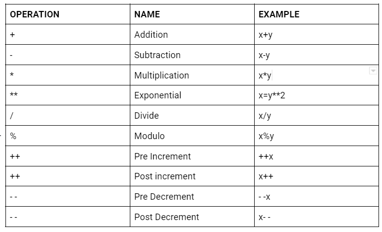
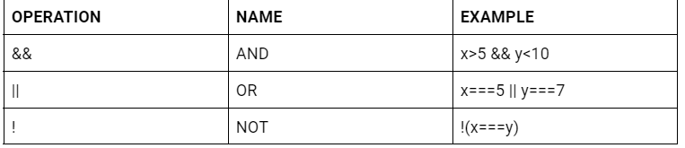

# Web Development Workshop

## FRAMEWORKS

    A framework in programming is a tool that provides ready-made components or solutions that are customised in order to speed up development. 

### FRONTEND FRAMEWORK & BACKEND FRAMEWORK

    Front-end frameworks (client-side frameworks) provide basic templates and components of HTML, CSS, and JavaScript for building the front-end of a website or web app.
    EG: Angular JS, BootStrap, React JS

    Backend frameworks (server-side frameworks)  programming languages that help build the backend structure of a website.
    EG: Django, Express JS,  Flask

### BOOTSTRAP

    Bootstrap helps us quickly create nice looking, responsive modern websites so we don't have to write as much CSS as we might.

    So to get more specific, it really consists of two main things.
    COMPONENTS - Buttons, Navbars 
    GRID SYSTEM - Bootstrap’s grid system uses a series of containers, rows, and columns to layout and align content. It’s built with flexbox and is fully responsive. 

### GO TO BOOTSTRAP WEBSITE AND EXPLAIN THINGS

[Bootstrap Offical Website](https://getbootstrap.com/)

### JAVASCRIPT

    JavaScript is the Programming Language for the Web.
    JavaScript can update and change both HTML and CSS.
    JavaScript can calculate, manipulate and validate data.

### DATA TYPES (what type of value)

    Number, String, Null, Boolean, Undefined 

    Conceptually, undefined indicates the absence of a value, while null indicates the absence of an object 

### VARIABLES

    JavaScript variables are containers for storing data values. You could change the value of a variable 
    In this example, x, y, and z, are variables:
```
var x = 5;
var y = 6;
var z = x + y;
var carname = "Volvo XC60"
```

### OPERATIONS WITH VARIABLES 

#### ARITHMETIC



#### ASSIGNMENT


#### COMPARISON


#### TERNARY


##### Example
```
let age = 17;
let text = (age < 18) ? "Too young":"Old enough";
text + " to vote.";
```

#### Logical



### OBJECTS

    Objects are variables too. But objects can contain many values.
    Object values are written as name : value pairs (name and value separated by a colon).

    var car = {type:"Fiat", model:"500", color:"white"};
    "The car type is " + car.type;

### ARRAYS


    JavaScript arrays are used to store multiple values in a single variable.

```
var cars = ["Saab", "Volvo", "BMW"];
cars;
```

    You should use objects when you want the element names to be strings (text). You should use arrays when you want the element names to be numbers.Objects will be used when we need fast access, insertion and removal of an element as objects are comparatively much faster than the arrays in case of insertion and removal.

### FUNCTIONS

    A JavaScript function is a block of code designed to perform a particular task.
    A JavaScript function is executed when "something" invokes it (calls it).
<br />

### Two types of functions, Built In Functions, User Defined Functions.

<br />

__User Defined Functions__

Something that we define,

```
function myFunction(p1, p2) {
    return p1 * p2;
}
myFunction(4,5)4;
```

__Built In Function__
<br />

[JavaScript Built-in Functions](https://www.tutorialspoint.com/javascript/javascript_builtin_functions.htm)


__WHAT CAN JAVASCRIPT DO?__

    JavaScript Can Change HTML Content
    JavaScript Can Change HTML Attribute Values
    JavaScript Can Change HTML Styles (CSS)
    JavaScript Can Hide HTML Elements
    JavaScript Can Show HTML Elements

